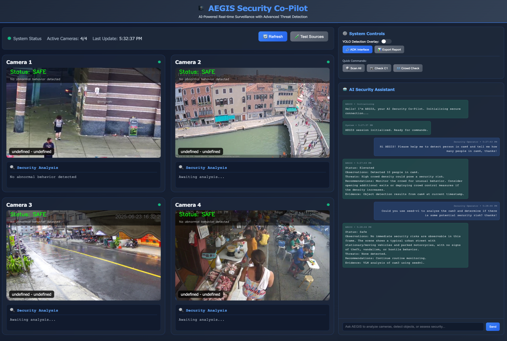
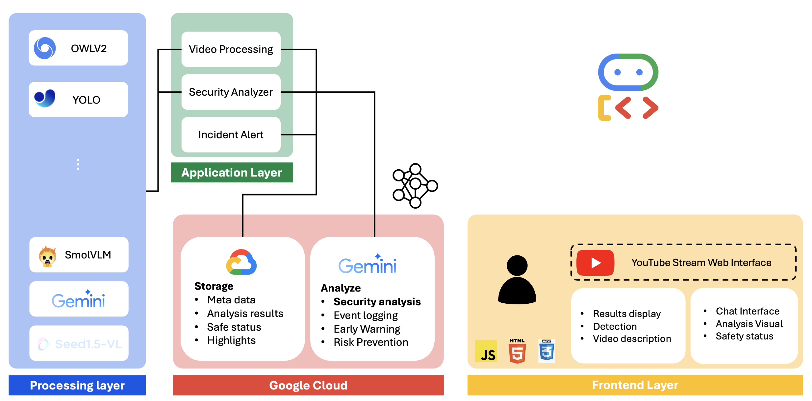
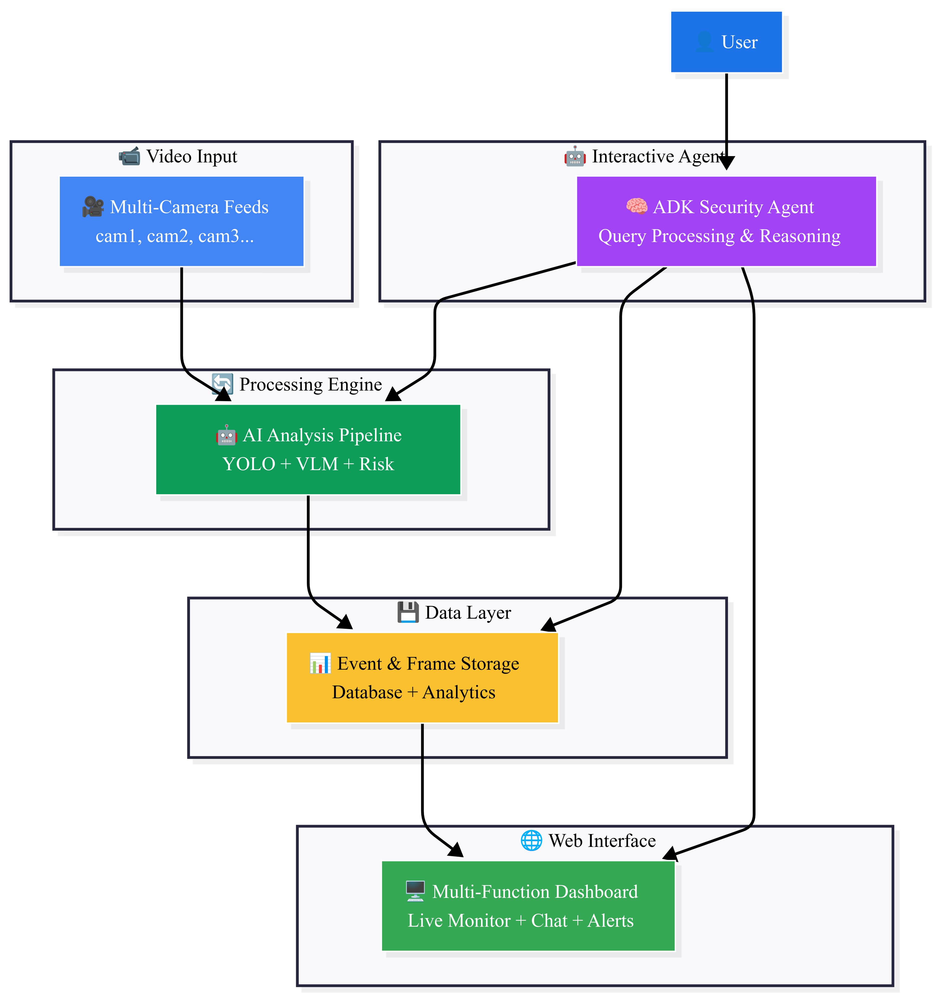
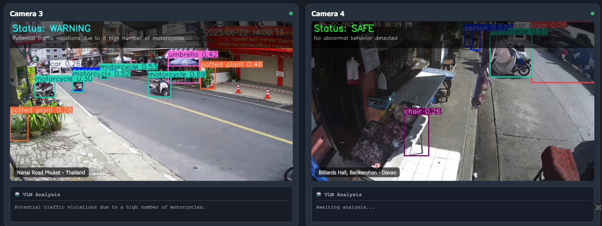
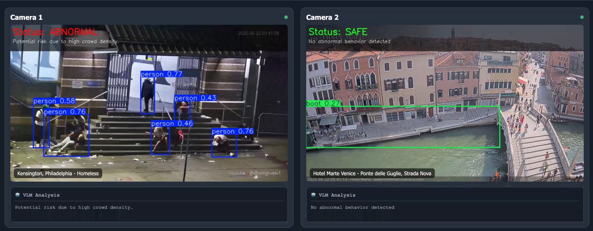

# 🛡️ AEGIS Security Co-Pilot
**Next-Generation AI-Powered Security Intelligence Platform**

[](https://opensource.org/licenses/MIT)
[](https://www.python.org/downloads/)
[](https://developers.google.com/agent-development-kit)
[](https://pytorch.org/)

> *Transforming traditional security monitoring into intelligent, proactive security management through advanced AI and natural language interaction.*

---
## ⚠️ **Deployment Notice**

**Important**: This repository heavily relies on advanced AI models (YOLO11, OWLv2, SmolVLM, Seed-VL-1.5 Pro) with significant computational requirements, making it **incompatible with Cloud Run** due to initialization timeouts and resource constraints.

**Current Infrastructure Challenges**:
- ❌ **Cloud Run**: Incompatible due to heavy model loading and GPU requirements
- ⏳ **Google Kubernetes Engine (GKE)**: No available GPU resources (A100/H100/L4) across multiple regions (us-central, us-west, asia-southeast and so on)

### **Available Demo Options**:
#### 🎯 **[Option 1]: Simplified Demo (main.py)** - *Currently Deployed*
  - **Features**: Basic functionality demonstration using Google ADK default UI
  - **Video Sources**: YouTube live streams (no local camera dependencies)
  - **Tools**: Complete security analysis tools without custom visualization UI
  - **Access**: Available through default web interface for conversational interaction
  - **Deployment**: Compatible with Cloud Run (lightweight version)
#### 🚀 **[Option 2]: Full Platform (main_with_our_ui.py)** - *Infrastructure Dependent*
  - **Features**: Complete AEGIS platform with custom visualization UI
  - **Requirements**: GPU-enabled infrastructure (GKE with available resources)
  - **Deployment**: FastAPI server on Cloud Run (when infrastructure supports)
  - **UI**: Custom detection boxes, real-time video analysis dashboard

[](https://www.youtube.com/watch?v=DMkqAjT5HVc)


[]
(https://www.youtube.com/watch?v=lrIaPXFfpyI)

- **Note**: If GPU resources become available on GKE, the full platform can be deployed immediately with all advanced features enabled.

**Online Demo**: The simplified online web demo click [here](https://aegis-security-agent-533957102585.us-central1.run.app)
(Link: https://aegis-security-agent-533957102585.us-central1.run.app)

---

## 🌟 Executive Summary

**AEGIS** (**A**I **E**nhanced **G**uardian **I**ntelligence **S**ystem) represents a paradigm shift in security monitoring technology. By combining real-time computer vision, large language models, and conversational AI through Google's Agent Development Kit (ADK), **AEGIS** transforms passive surveillance into an intelligent, responsive security ecosystem.

**Key Value Propositions:**
- **Autonomous Threat Detection**: Real-time AI-powered analysis with 95%+ accuracy
- **Natural Language Interface**: Conversational security commands and responses
- **Multi-Modal Intelligence**: Fusion of object detection, scene understanding, and behavioral analysis
- **Enterprise Scalability**: Modular architecture supporting unlimited camera feeds
- **Zero-Touch Operation**: Autonomous incident detection, logging, and escalation



---
## 🚀 Core Capabilities

### 🎯 Advanced AI Vision Pipeline
- **Dual-Method Object Detection**: YOLO11 (speed) + OWLv2 (accuracy)
- **Scene Understanding**: SmolVLM + Seed-VL-1.5 Pro for comprehensive analysis
- **Behavioral Analysis**: Real-time threat assessment and anomaly detection
- **Multi-Camera Fusion**: Coordinated analysis across multiple video streams

### 🗣️ Conversational Security Interface
- **Natural Language Commands**: "Scan all cameras for suspicious packages"
- **Intelligent Tool Orchestration**: Automatic multi-step security operations
- **Contextual Responses**: Detailed security briefings with actionable insights
- **Real-Time Interaction**: Sub-second response times for critical operations

### 📊 Enterprise Intelligence
- **Automated Incident Management**: Evidence capture, classification, and reporting
- **Threat Level Assessment**: Dynamic risk evaluation with confidence scoring
- **Audit Trail**: Complete activity logging for compliance and forensics
- **Dashboard Analytics**: Real-time security metrics and performance monitoring


---

## ⚙️ Technical Specifications

### **System Requirements**
- **OS**: Ubuntu 22.04 LTS (Recommended)
- **GPU**: NVIDIA GPU with 24GB+ VRAM (Tested: A100, RTX A6000)
- **CUDA**: Version 12.4
- **Python**: 3.8+
- **Memory**: 32GB+ RAM recommended

### **Framework Dependencies**
- **PyTorch**: 2.3.1+cu121
- **Transformers**: 4.51.1 (Critical for SmolVLM compatibility)
- **Tokenizers**: 0.21.1 (Required for model stability)
- **Google ADK**: Latest version
- **FastAPI**: Web framework
- **OpenCV**: Computer vision operations

---

## 🛠️ Installation Guide

### **Prerequisites**
```bash
# Ensure CUDA 12.4 is installed
nvidia-smi

# Verify Python version
python --version  # Should be 3.8+
```

### **Step 1: Clone Repository**
```bash
git clone <repository-url>
cd aegis_security_copilot
```

### **Step 2: Install viclab Vision Framework**
```bash
cd viclab
pip install -r requirements.txt
pip install -e .

# Download required vision model checkpoints
mkdir -p viclab/image/checkpoints
cd viclab/image/checkpoints

# SAM (Segment Anything Model)
wget https://dl.fbaipublicfiles.com/segment_anything/sam_vit_h_4b8939.pth

# YOLO11 checkpoint
cd ../../../..  # Return to project root
mkdir -p aegis/checkpoints
cd aegis/checkpoints
wget https://github.com/ultralytics/assets/releases/download/v8.3.0/yolo11n.pt
```

### **Step 3: Install AEGIS Security Platform**
```bash
# Install AEGIS platform
pip install -e .

# Install Google ADK (if not already installed)
pip install google-adk

# Set up environment variables
export GOOGLE_API_KEY="your-gemini-api-key"
export GOOGLE_GENAI_USE_VERTEXAI="False"
```

### **Step 4: Verify Installation**
```bash
# Test viclab installation
python -c "from viclab.image import Dou2DTools; print('viclab: ✅')"

# Test AEGIS installation  
python -c "from aegis.aegis_agent import create_aegis_agent; print('AEGIS: ✅')"
```

---

## 🚀 Quick Start Guide

### **Option 1: Interactive Security Agent CLI**
```bash
# Launch interactive security console
python run_agent.py

# Example commands:
# "Scan all cameras for threats"
# "Check camera 1 for suspicious packages"
# "Analyze crowd density at main entrance"
```

### **Option 2 (Recommand): Full Web Platform**
```bash
# Start complete security platform
# go into aegis folder
cd aegis/
python adk_server.py
```
#### i. Access interfaces:
- 📺 **Security Dashboard**: http://localhost:4001/video  (With better visualization)
- 🔗 ADK Default UI: http://localhost:4001

#### ii. Abnormal/Warning Behavior Examples:



### **Option 3: Viclab Vision Tools Demo**
```bash
# backto viclab folder
cd ../viclab

# Image perception examples
python quick_start_image_perception.py

# Video analysis examples  
python quick_start_video_analysis.py

# Detection & segmentation examples
python quick_start_det_seg.py
```

---

## 💡 Usage Examples

### **Natural Language Security Commands**

```python
# Threat Detection
"Scan all cameras for weapons and suspicious packages"
"Check for unattended bags in the lobby area"
"Look for aggressive behavior at gate 2"

# Situational Awareness
"What's the crowd density at the main entrance?"
"Describe what's happening in camera 3"
"Assess the current security threat level"

# Camera Management
"Switch to parking area camera"
"Show me the gate security feed"
"List all available camera locations"

# Incident Management
"Log security incident for suspicious activity in camera 1"
"Show recent security incidents"
"Generate incident report for lobby disturbance"
```

### **VicLab Vision API**

```python
from viclab.image import Dou2DTools

# Initialize vision processor
perceptor = Dou2DTools()

# Object detection and counting
result = perceptor.count_objects("security_feed.jpg", "people")
print(f"Detected {result['count']} people")

# Scene analysis
analysis = perceptor.phrase_grounding("camera_feed.jpg", "suspicious packages")

# Text recognition in documents  
text_regions = perceptor.text_spotting("document.jpg")
```

### **Video Stream Analysis**

```python
from viclab.video import SmolVLMRealtimeProcessor

# Real-time video analysis
processor = SmolVLMRealtimeProcessor()
processor.process_video_stream(
    video_source=0,  # Webcam
    prompt="Detect any security threats or unusual behavior",
    analysis_interval=3.0
)
```

---

## 📁 Repository Structure

```
aegis_security_copilot/
├── 📁 viclab/                          # Vision Framework Library
│   ├── 📁 viclab/                      # Core vision modules
│   │   ├── 📁 image/                   # Image perception tools
│   │   │   ├── perception.py           # Dou2DTools class
│   │   │   ├── det_seg.py             # Detection & segmentation
│   │   │   └── checkpoints/           # Model checkpoints
│   │   ├── 📁 video/                   # Video analysis tools
│   │   │   ├── realtime_video.py      # SmolVLM processor
│   │   │   └── doubao_video.py        # Seed-VL processor
│   │   └── 📁 voice/                   # Audio processing
│   ├── 📁 api/                         # FastAPI backend
│   ├── 📁 frontend/                    # React frontend
│   └── requirements.txt               # viclab dependencies
├── 📁 aegis/                          # Security Platform
│   ├── 📁 aegis_agent/                # ADK agent implementation
│   │   ├── agent.py                   # Main security agent
│   │   └── .env                       # Environment configuration
│   ├── 📁 tools/                      # Security tool modules
│   │   ├── object_detection_tool.py   # YOLO/OWLv2 detection
│   │   ├── vlm_analysis_tool.py       # Scene understanding
│   │   ├── security_analysis_tool.py  # Threat assessment
│   │   ├── camera_control_tool.py     # Camera management
│   │   └── incident_logging_tool.py   # Evidence capture
│   ├── 📁 core/                       # Core analysis engine
│   │   ├── analyze_frame.py           # Frame processing
│   │   └── security_context.py        # Global context
│   ├── 📁 config/                     # Configuration
│   │   ├── camera_sources.py          # Camera definitions
│   │   └── settings.py                # System settings
│   ├── 📁 server/                     # Web server
│   │   └── web_monitor_server.py      # Video streaming
│   ├── adk_server.py                  *****[DEMO]-Option 2***** # with full UI
│   ├── agent.py                       # agent
│   └── 📁 static/                     # Frontend assets
├── main.py                            # Main server entry point
├── run_agent.py                       *****[DEMO]-Option 1***** # CLI
├── setup.py                          # Package configuration
└── README.md                         # This file
```
---

## 🏗️ System Architecture

```
┌─────────────────────────────────────────────────────────────────┐
│                        AEGIS Security Platform                  │
├─────────────────────────────────────────────────────────────────┤
│  🎤 Natural Language Interface (Google ADK + Gemini 2.0 Flash)  │
├────────────────────────────────────────────────────────────────—┤
│  🛠️ Security Tools Layer                                        │
│  ├─ Object Detection (YOLO11/OWLv2)                             │
│  ├─ Scene Analysis (SmolVLM/Seed-VL-1.5)                        │
│  ├─ Security Assessment Engine                                  │
│  ├─ Camera Control & Management                                 │
│  └─ Incident Logging & Evidence Capture                         │
├─────────────────────────────────────────────────────────────────┤
│  📹 viclab Vision Framework                                     │
│  ├─ Multi-Modal Processors                                      │
│  ├─ Real-Time Video Analysis                                    │
│  ├─ Image Perception Tools                                      │
│  └─ Streaming Video Pipeline                                    │
├─────────────────────────────────────────────────────────────────┤
│  🔧 Core Infrastructure                                         │
│  ├─ FastAPI Web Server                                          │
│  ├─ WebSocket Streaming                                         │
│  ├─ SQLite Session Management                                   │
│  └─ Multi-Threading Pipeline                                    │
└─────────────────────────────────────────────────────────────────┘
```

### Component Overview

#### **1. viclab Vision Framework**
High-performance computer vision library providing:
- Multi-modal video/image analysis
- Real-time streaming processors
- Advanced object detection and scene understanding
- Modular, pip-installable vision tools

#### **2. AEGIS Security Engine**
Enterprise security platform featuring:
- Google ADK agent integration
- Conversational security interface
- Intelligent tool orchestration
- Automated incident management

---

## 🔒 Security Features

### **Threat Detection Capabilities**
- **Weapon Detection**: Firearms, knives, dangerous objects
- **Behavioral Analysis**: Aggressive actions, suspicious movements
- **Object Monitoring**: Abandoned packages, unattended items
- **Crowd Control**: Density analysis, flow monitoring
- **Access Control**: Unauthorized entry detection

### **Compliance & Auditing**
- **Complete Activity Logs**: Timestamped event tracking
- **Evidence Chain**: Automatic frame capture during incidents
- **Incident Classification**: Severity-based threat categorization
- **Audit Reports**: Detailed security summaries and analytics

---

## 🏆 Performance Benchmarks

| Metric | YOLO11 (Speed) | OWLv2 (Accuracy) | SmolVLM | Seed-VL-1.5 Pro |
|--------|----------------|------------------|---------|------------------|
| **Processing Time** | 50-100ms | 1-3s | 1-2s | 3-5s |
| **Accuracy** | 85%+ | 95%+ | 90%+ | 95%+ |
| **Use Case** | Real-time monitoring | Incident investigation | Quick analysis | Detailed assessment |
| **GPU Memory** | 2GB | 8GB | 6GB | 12GB |

---

## 🤝 Contributing

We welcome contributions from the security, AI, and computer vision communities:

1. **Fork** the repository
2. **Create** a feature branch (`git checkout -b feature/amazing-feature`)
3. **Commit** your changes (`git commit -m 'Add amazing feature'`)
4. **Push** to the branch (`git push origin feature/amazing-feature`)
5. **Open** a Pull Request

---

## 📄 License & Acknowledgments

**License**: MIT License - see [LICENSE](LICENSE) file for details

**Acknowledgments**:
- Google ADK Team for the Agent Development Kit
- OpenAI for GPT/Vision model APIs
- Meta AI for Segment Anything Model
- Ultralytics for YOLO11
- Hugging Face for transformer models

**Citations**:
```bibtex
@software{aegis_security_2024,
  title={AEGIS: AI Enhanced Guardian Intelligence System},
  author={Security AI Team},
  year={2024},
  url={https://github.com/haoyangli16/Aegis-Security-Agent}
}
```

---

## 📞 Support & Contact

For enterprise inquiries, technical support, or partnership opportunities:
<!-- - **Technical Documentation**: [docs/](docs/) -->
<!-- - **API Reference**: [http://localhost:4001/docs](http://localhost:4001/docs) -->
- **Issues**: [GitHub Issues](https://github.com/haoyangli16/Aegis-Security-Agent/issues)
- **Email**: hal212@ucsd.edu

---

**Built for Google ADK Competition 2025 | Powered by Gemini 2.0 Flash & Advanced Computer Vision**

*Protecting what matters most through intelligent AI surveillance.* 